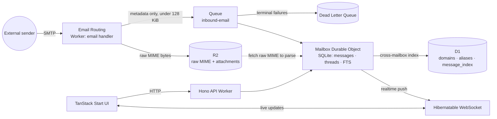

<div align="center">


<h3>The agent-native inbox — self-hosted email on Cloudflare</h3>

<p>Receive, store, thread, search and send email from your own domains, running <strong>entirely on Cloudflare</strong> (Workers · Durable Objects · R2 · D1 · Queues) — with an <strong>MCP layer</strong> on the roadmap so agents can read, triage and draft your mail.</p>

[](https://github.com/santigamo/reccado/actions/workflows/ci.yml)
[](./LICENSE)
[](https://workers.cloudflare.com)
[](https://www.typescriptlang.org)
[](https://hono.dev)
[](CHANGELOG.md)

<br>

[](https://deploy.workers.cloudflare.com/?url=https://github.com/santigamo/reccado)

</div>

---

**Reccado is a self-hosted, full-serverless email inbox that runs entirely on your own Cloudflare
account** — no third-party mail provider, no separate database to operate, no servers to patch.

## Table of contents

- [Features](#features)
- [How it works](#how-it-works)
- [Quickstart (prove it locally in ~5 min)](#quickstart-prove-it-locally-in-5-min)
- [Deploy your own](#deploy-your-own)
  - [1. Create the Cloudflare resources](#1-create-the-cloudflare-resources)
  - [2. Apply D1 migrations](#2-apply-d1-migrations)
  - [3. Set secrets](#3-set-secrets)
  - [4. Configure Email Routing](#4-configure-email-routing)
  - [5. Set up Cloudflare Access](#5-set-up-cloudflare-access)
  - [6. Deploy](#6-deploy)
- [Configuration](#configuration)
- [Compatibility](#compatibility)
- [Troubleshooting](#troubleshooting)
- [Learn more](#learn-more)

## Features

- **Self-hosted, your Cloudflare account** — your mail, your R2, your D1, your Durable Objects.
  Nothing leaves your account.
- **Full-serverless** — Workers, Durable Objects, R2, D1 and Queues only. No VM, no container,
  no third-party database to provision or back up.
- **One Durable Object per mailbox** — canonical mailbox state (messages, threads, labels, FTS
  search, drafts, idempotency) lives in private per-mailbox SQLite, not a shared database.
- **Idempotent inbound pipeline** — Email Routing → R2 → Queue → Durable Object, with a DLQ for
  poison messages and dedupe on Message-ID/raw hash so retries never double-store a message.
- **Realtime UI** — hibernatable WebSockets push new mail into the inbox without polling or
  refreshing.
- **Full-text search** — SQLite FTS5 per mailbox over subject, sender, recipients and body.
- **Human-confirmed sending** — outbound mail always goes through an explicit draft →
  request-send → confirm-send flow with an idempotency key; nothing sends silently.
- **Multi-domain routing** — store, forward or reject rules per domain/alias, with isolated
  mailboxes per address.
- **Agent-native by design** — an MCP layer is on the roadmap so agents can read, search and
  draft mail, gated by the same human-confirmation invariant as the UI (see
  [`docs/ARCHITECTURE.md`](docs/ARCHITECTURE.md)).

## How it works

Inbound mail never touches a server you manage. Cloudflare Email Routing hands the raw message to
a Worker, which writes it straight to R2 and enqueues a small metadata event; a Queue consumer
hands that event to the one Durable Object that owns the target mailbox, which parses, indexes and
pushes a realtime update to any open UI session.



Queue messages carry metadata only (mailbox ID, R2 key, hashes, headers) — raw MIME and parsed
bodies never leave R2 and the owning Durable Object. D1 is a rebuildable cross-mailbox index, not
the source of truth: the mailbox Durable Object is the only component allowed to decide canonical
mailbox state. See [`docs/ARCHITECTURE.md`](docs/ARCHITECTURE.md) for the full accepted
architecture and the outbound flow.

## Quickstart (prove it locally in ~5 min)

This runs entirely on your machine via local Cloudflare Workers emulation (`@cloudflare/vite-plugin`)
— no Cloudflare account or deployed resources required.

```bash
pnpm install
pnpm dev
```

Vite defaults to port `3000`; if it's busy it prints the port it actually bound to — use that port
below.

In a second terminal, check the health endpoint and simulate an inbound email:

```bash
curl -sS http://localhost:3000/api/health
# {"ok":true}

pnpm smoke:email:local http://localhost:3000 fixtures/mime/simple-text.eml
```

Expected output (the script posts the fixture twice to prove duplicate delivery is idempotent):

```text
first-delivery: Worker successfully processed email
r2-head: {"exists":true,"key":"raw/dev/mbx_.../2026/06/30/...-<rawSha256>.eml","size":250,...}
duplicate-delivery: Worker successfully processed email
debug: {"messageCount":1,"messages":[{"id":"...","idempotency_key":"email:v1:mbx_...:message-id:...","subject":"..."}]}
queue-payload-sample: {"eventType":"email.received.v1","mailboxId":"mbx_...","rawR2Key":"raw/dev/...","rawSha256":"...","idempotencyKey":"email:v1:mbx_...:message-id:..."}
PASS: local email smoke completed with one DO message after duplicate delivery
```

The first delivery is the success signal that matters: `r2-head.exists: true` means the raw MIME
landed in R2, and `debug.messageCount: 1` after **two** deliveries of the same fixture proves the
Durable Object deduplicated it. Open `http://localhost:3000/mailboxes` to see the seeded
`test@example.com` mailbox in the UI.

Other local commands:

```bash
pnpm test               # vitest (Workers runtime via @cloudflare/vitest-pool-workers)
pnpm typecheck           # tsc --noEmit
pnpm lint                # biome lint .
pnpm check               # typecheck + lint + test in one shot
pnpm run build           # production build
pnpm smoke:ws ws://localhost:3000/api/mailboxes/mbx_test/ws   # WebSocket hello/pong/echo smoke
```

## Deploy your own

[](https://deploy.workers.cloudflare.com/?url=https://github.com/santigamo/reccado)

The one-click button forks the repo, **provisions the R2 bucket, D1 database, queues and Durable
Object** from `wrangler.jsonc`, prompts you for the secrets, and deploys the Worker. The numbered
steps below are the equivalent CLI path — and whichever route you take, **steps 4–5 (Email Routing
and Cloudflare Access) are domain-level setup you wire once**, since they live outside the Worker.

The repo ships with placeholder identity so it's safe to fork: replace every `example.com` /
`mail.example.com` reference and the placeholder Cloudflare IDs with your own. Full command-level
detail lives in [`docs/IMPLEMENTATION.md`](docs/IMPLEMENTATION.md).

### 1. Create the Cloudflare resources <sub>(the one-click button provisions these for you)</sub>

```bash
pnpm wrangler r2 bucket create <your-raw-mail-bucket>
pnpm wrangler queues create <your-inbound-queue>
pnpm wrangler queues create <your-inbound-dlq>
pnpm wrangler d1 create <your-index-db-name> --location=weur
```

Update `wrangler.jsonc` (`r2_buckets`, `queues.producers`/`queues.consumers`, `d1_databases`) with
the names and the `database_id` `wrangler d1 create` prints. The Durable Object binding
(`MAILBOX_DO` / `MailboxDurableObject`) needs no separate creation step — Wrangler provisions it
from the `migrations` block on first deploy.

### 2. Apply D1 migrations

```bash
pnpm d1:migrate:local   # wrangler d1 migrations apply <db> --local
pnpm d1:migrate:dev     # wrangler d1 migrations apply <db> --remote --env dev
pnpm d1:migrate:prod    # wrangler d1 migrations apply <db> --remote (default/production env)
```

By default those scripts target the example names already in `wrangler.jsonc`
(`inbox-mcp-index-dev` / `inbox-mcp-index`) so the maintainer dev flow keeps working. Self-hosters
should override them with env vars instead of editing `package.json`:

```bash
D1_DB_NAME_LOCAL=<your-dev-db-name> pnpm d1:migrate:local
D1_DB_NAME_DEV=<your-dev-db-name> pnpm d1:migrate:dev
D1_DB_NAME_PROD=<your-prod-db-name> pnpm d1:migrate:prod
```

You can also run `wrangler d1 migrations apply <db> ...` directly if you prefer.

### 3. Set secrets <sub>(the one-click setup page prompts for these)</sub>

Every secret name below is documented in [`.dev.vars.example`](.dev.vars.example) for local dev.
For a deployed environment, set each with `wrangler secret put`:

```bash
pnpm wrangler secret put MAILBOX_ID_SECRET --env dev
pnpm wrangler secret put ACCESS_JWT_AUDIENCE --env dev
pnpm wrangler secret put ACCESS_TEAM_DOMAIN --env dev
pnpm wrangler secret put CLOUDFLARE_API_TOKEN --env dev   # only if you use admin provisioning
pnpm wrangler secret put PHASE0_DEBUG_TOKEN --env dev     # only if you need the debug endpoints
pnpm wrangler secret put ACCESS_ALLOWED_EMAILS --env dev  # optional owner allowlist
```

Drop `--env dev` for the production environment. See [Configuration](#configuration) for what
each one does and whether it's required.

### 4. Configure Email Routing

In the Cloudflare dashboard (or via the API), point Email Routing for your domain at this Worker:

- Enable Email Routing on your zone.
- Add a routing rule: match the address(es) you want to receive, action "Send to a Worker", target
  your deployed Worker (`reccado-dev` / `reccado`, or your renamed equivalent).
- For outbound, onboard your sending domain under Email Sending in the dashboard and set
  `MAIL_FROM_ADDRESS` in `wrangler.jsonc` (`vars`) to a verified sender on that domain.

### 5. Set up Cloudflare Access

Reccado has no built-in login screen — **Cloudflare Access is the auth perimeter** for the UI and
`/api/*`. Create a self-hosted Access application in front of your Worker's route/domain, add an
allow policy for your email (or identity provider group), and capture the application's audience
(`aud`) tag and your Zero Trust team domain for `ACCESS_JWT_AUDIENCE` / `ACCESS_TEAM_DOMAIN` above.
Optionally set `ACCESS_ALLOWED_EMAILS` as a second, app-level allowlist on top of Access. See
[`SECURITY.md`](SECURITY.md) for the full auth model.

### 6. Deploy <sub>(done by the one-click button)</sub>

```bash
pnpm run deploy:dev   # build + wrangler deploy --env dev --name reccado-dev
pnpm run deploy       # build + wrangler deploy (default/production environment)
```

After deploying, confirm Access is actually blocking unauthenticated traffic — for `dev`,
`curl -i https://reccado-dev.<your-subdomain>.workers.dev/api/health` should redirect to your
Access login, not return `200` (production isn't on `*.workers.dev` at all; see
[Compatibility](#compatibility)). Then log in through Access and confirm `/api/health` returns
`{"ok":true}`.

### 7. Verify the Cloudflare bindings you actually deployed

The repo ships a verifier for the Worker name, bindings, queues, D1, Email Sending, and an example
Email Routing rule. The defaults still match the maintainer dev example so existing validation
commands keep working:

```bash
pnpm verify:cf
```

For your own deployment, pass your resource names and IDs by env var or CLI flag instead of editing
the script:

```bash
CF_VERIFY_ENV=dev \
CF_VERIFY_WORKER=<your-dev-worker-name> \
CF_VERIFY_R2_BUCKET=<your-dev-r2-bucket> \
CF_VERIFY_QUEUE=<your-dev-queue> \
CF_VERIFY_DLQ=<your-dev-dlq> \
CF_VERIFY_D1_NAME=<your-dev-d1-name> \
CF_VERIFY_D1_ID=<your-dev-d1-id> \
CF_VERIFY_EMAIL_SENDING_DOMAIN=<your-sending-domain> \
CF_VERIFY_ROUTING_DOMAIN=<your-routing-domain> \
CF_VERIFY_ROUTING_ADDRESS=<your-test-alias> \
pnpm verify:cf
```

Equivalent CLI flags are available (`--env`, `--worker`, `--r2`, `--queue`, `--dlq`, `--d1`,
`--d1-id`, `--email-sending-domain`, `--routing-domain`, `--routing-address`). The verifier checks
that the values in `wrangler.jsonc` match the resources you intended to use, then confirms those
resources exist in the current Cloudflare account.

## Configuration

### Secrets and vars

| Name | Kind | Purpose | Required? |
| --- | --- | --- | --- |
| `MAILBOX_ID_SECRET` | secret | HMAC key used to derive stable, privacy-preserving mailbox IDs from email addresses. Never rotate without a mailbox-ID migration plan — rotating it changes every mailbox ID. | **Required** |
| `ACCESS_JWT_AUDIENCE` | secret | Cloudflare Access application audience (`aud`) tag, used to validate the `CF-Access-JWT-Assertion` header on every API request. | **Required** for any non-`localhost` deployment (auth fails closed without it) |
| `ACCESS_TEAM_DOMAIN` | secret | Your Cloudflare Zero Trust team domain (`https://<your-team>.cloudflareaccess.com`), used to fetch the JWKS that validates the Access JWT. | **Required** for any non-`localhost` deployment |
| `ACCESS_ALLOWED_EMAILS` | secret | Optional comma-separated owner allowlist enforced in addition to Cloudflare Access, for an extra app-level check beyond the Access policy. | Optional |
| `CLOUDFLARE_API_TOKEN` | secret | Least-privilege token for admin provisioning workflows (domain/zone read, Email Routing write, Access app/policy write). Only needed if you use the in-app provisioning flows rather than the dashboard. | Optional |
| `PHASE0_DEBUG_TOKEN` | secret | Gates the `/api/debug/phase0/*` introspection endpoints (R2 head, DO schema/state dumps, local email simulation in deployed environments). These endpoints are unreachable unless this token is set, and every request must present it. | Optional (leave unset to disable debug endpoints entirely) |
| `MAIL_FROM_ADDRESS` | var (`wrangler.jsonc` → `vars`) | Default outbound sender address. Must be a verified sender on a domain onboarded to Cloudflare Email Sending. | **Required** |

### Bindings (`wrangler.jsonc`)

| Binding | Type | Purpose | Required? |
| --- | --- | --- | --- |
| `MAILBOX_DO` | Durable Object (`MailboxDurableObject`, SQLite storage) | Canonical per-mailbox state: messages, threads, labels, FTS, drafts, outbox, idempotency, realtime WebSocket sessions. | **Required** |
| `MAIL_OBJECTS` | R2 bucket | Raw inbound MIME, parsed HTML bodies, attachments, backup manifests/exports. | **Required** |
| `INBOUND_EMAIL_QUEUE` | Queue producer + consumer | Metadata-only transport from the Email Routing handler to the mailbox Durable Object, with a configured `dead_letter_queue` for poison messages. | **Required** |
| `INDEX_DB` | D1 database | Cross-mailbox/control-plane index: `domains`, `mailboxes`, `aliases`, `routing_rules`, `message_index`, `ingest_events`, `outbound_sends`, `ops_events`. Rebuildable from the Durable Objects, not authoritative. | **Required** |
| `EMAIL` | Email Sending (`send_email`) | Outbound mail via `env.EMAIL.send()` after explicit human confirmation. | **Required** for outbound sending |
| `triggers.crons` | Cron Trigger | Periodic backup sweep (writes per-mailbox manifests to R2 and an `ops_events` row). | **Required** for scheduled backups |

## Compatibility

- **Node.js** — `engines.node: ">=22.12.0"` in `package.json`. CI runs Node 24.
- **pnpm** — `packageManager: pnpm@11.1.1` in `package.json`. Use Corepack or install that version
  directly.
- **Wrangler** — `^4.105.0` (devDependency). Cloudflare resource commands in this README assume a
  4.x Wrangler CLI.
- **Cloudflare plan** — outbound sending to **arbitrary recipients** (not just verified
  destination addresses) requires a **Workers Paid plan**; see
  [`docs/ARCHITECTURE.md`](docs/ARCHITECTURE.md) (Risks) and
  [`docs/IMPLEMENTATION.md`](docs/IMPLEMENTATION.md) (Prerequisites).
- **Cloudflare features** required on the account: Workers, Durable Objects, R2, Queues, D1, Email
  Routing, Email Sending, Cron Triggers, and Access (Zero Trust).
- **Production routing** — the default (production) environment ships with `workers_dev: false`
  in `wrangler.jsonc`: it is intentionally not reachable on the shared `*.workers.dev` subdomain.
  Front it with your own route/custom domain before deploying to production. The `dev` environment
  (`reccado-dev`) is unaffected and stays reachable at `*.workers.dev` for local-to-cloud testing.

## Troubleshooting

| Symptom | Likely cause | Fix |
| --- | --- | --- |
| Queue backlog growing | Mailbox Durable Object errors on ingest, or D1 index writes failing | Inspect Queues metrics and tail Worker logs for the failing mailbox; check DO errors before pausing inbound routing (only pause if there's real data-loss risk). |
| DLQ non-empty | Poison messages (unsupported schema version) or repeated transient ingest failures | Inspect `/api/admin/dlq`, classify poison vs. transient, fix the underlying code/config, and only replay after confirming idempotency keys make replay safe. |
| `email()` handler errors before enqueue | R2 write failure while storing raw MIME | The handler must not enqueue without a raw R2 key — let Email Routing's retry/reject behavior handle it; do not enqueue partial state. |
| Mailbox stops updating but inbound keeps arriving | D1 is unavailable | The Durable Object remains the source of truth and keeps ingesting; the D1 cross-mailbox index falls behind. Retry the index write through the Queue, then run `/api/admin/reindex` for the affected mailbox once D1 recovers. |
| A message shows up with no parsed body/search hits | MIME parsing failed inside the Durable Object | Expected degraded behavior: the message row is kept with `parse_status='failed'` and the raw R2 key preserved (the email is never dropped); check `/api/admin/ops-events` for the parse-failure event. |
| `confirm-send` returns an error and nothing sends | Outbound send failed at the provider, or recipient/size limits exceeded | Check `outbound_sends.status='failed'` and `error_code` for the draft; fix the underlying issue (recipient count, size, sender verification) and retry — `confirm-send` is idempotency-keyed, so retries with the same key never double-send. |
| `curl /api/health` returns `200` directly instead of redirecting to Access login | Cloudflare Access is misconfigured or not enabled on that route | Treat this as a security incident: block public access to the API first (disable the route or tighten the Access policy), then fix and re-verify the Access app/policy before reopening it. |
| `pnpm wrangler deploy --env dev` deploys the wrong Worker name | The Cloudflare Vite plugin can redirect Wrangler to its own generated config and drop the `--env` name override | Always deploy with both flags explicit: `pnpm wrangler deploy --env dev --name reccado-dev` (this is exactly what `pnpm run deploy:dev` does). |
| Local large-MIME smoke (`pnpm smoke:email:large`) fails around 1 MiB | Cloudflare's local Email Routing test path enforces a much lower size limit (~1 MiB) than the 25 MiB production inbound limit | Expected local-tooling behavior, not a bug — generate a fixture under ~1 MiB for local smoke (`pnpm generate:large-mime`), and trust the documented 25 MiB production limit (see [`docs/PHASE0_VALIDATION.md`](docs/PHASE0_VALIDATION.md)). |

For actual operating procedures, rollback, DLQ handling, and current retention/export limitations,
use [`docs/OPERATIONS.md`](docs/OPERATIONS.md). That document is the current-state runbook; this
README stays at deploy/setup depth.

## Learn more

- [`SECURITY.md`](SECURITY.md) — security model, hardening defaults, and how to report a
  vulnerability.
- [`CONTRIBUTING.md`](CONTRIBUTING.md) and [`AGENTS.md`](AGENTS.md) — dev setup, PR expectations,
  and the operating guide for AI coding agents working in this repo.
- [`docs/ARCHITECTURE.md`](docs/ARCHITECTURE.md) — accepted architecture, component responsibilities,
  and tradeoffs.
- [`docs/IMPLEMENTATION.md`](docs/IMPLEMENTATION.md) — executable implementation runbook.
- [`docs/OPERATIONS.md`](docs/OPERATIONS.md) — current-state ops reference (bindings, runbook,
  data model).
- [`CHANGELOG.md`](CHANGELOG.md) — what shipped and when.
