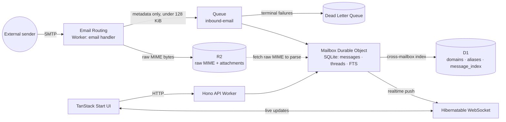

<div align="center">


<h3>The edge-native inbox — self-hosted email on Cloudflare, for your own domains</h3>

<p>Receive, store, thread, search and send email from your own domains, running <strong>entirely on Cloudflare</strong> (Workers · Durable Objects · R2 · D1 · Queues) — with an <strong>MCP endpoint</strong> for agents (read/search/draft, no send) and a <strong>transactional REST API</strong> for programmatic outbound mail behind scoped API keys.</p>

[](https://github.com/santigamo/reccado/actions/workflows/ci.yml)
[](./LICENSE)
[](https://workers.cloudflare.com)
[](https://www.typescriptlang.org)
[](https://hono.dev)
[](CHANGELOG.md)

<br>

[](https://deploy.workers.cloudflare.com/?url=https://github.com/santigamo/reccado)

</div>

---

**Reccado is a self-hosted, full-serverless email inbox that runs entirely on your own Cloudflare
account** — no third-party mail provider, no separate database to operate, no servers to patch.
It ships a realtime inbox UI, an MCP endpoint for agents (read/search/draft only — sending stays
human-confirmed), and a scoped transactional REST API for programmatic outbound mail.

## Table of contents

- [Features](#features)
- [How it works](#how-it-works)
- [Quickstart (prove it locally in ~5 min)](#quickstart-prove-it-locally-in-5-min)
- [Deploy your own](#deploy-your-own)
  - [1. Provision and deploy (pick one)](#1-provision-and-deploy-pick-one)
  - [2. Wire your domain](#2-wire-your-domain)
  - [3. Verify](#3-verify)
- [Telegram bridge (optional)](#telegram-bridge-optional)
- [Transactional API (optional)](#transactional-api-optional)
- [Configuration](#configuration)
- [Compatibility](#compatibility)
- [Troubleshooting](#troubleshooting)
- [Learn more](#learn-more)

## Features

- **Self-hosted, your Cloudflare account** — your mail, your R2, your D1, your Durable Objects.
  Nothing leaves your account.
- **Full-serverless** — Workers, Durable Objects, R2, D1 and Queues only. No VM, no container,
  no third-party database to provision or back up.
- **One Durable Object per mailbox** — canonical mailbox state (messages, threads, labels, FTS
  search, drafts, idempotency) lives in private per-mailbox SQLite, not a shared database.
- **Idempotent inbound pipeline** — Email Routing → R2 → Queue → Durable Object, with a DLQ for
  poison messages and dedupe on Message-ID/raw hash so retries never double-store a message.
- **Realtime UI** — hibernatable WebSockets push new mail into the inbox without polling or
  refreshing.
- **Full-text search** — SQLite FTS5 per mailbox over subject, sender, recipients and body.
- **Human-confirmed sending** — outbound mail always goes through an explicit draft →
  request-send → confirm-send flow with an idempotency key; nothing sends silently.
- **Multi-domain routing** — store, forward or reject rules per domain/alias, with isolated
  mailboxes per address.
- **Telegram bridge (optional)** — new mail arrives as a card in Telegram; replying there builds a
  properly threaded email (`Re:`, `In-Reply-To`/`References`, quoted original) that still goes
  through the same confirm-send button. See [Telegram bridge](#telegram-bridge-optional).
- **Agent-ready** — an MCP endpoint (`/mcp`, Access + `ACCESS_ALLOWED_EMAILS` allowlist) exposes
  read/search/draft tools for agents; there is deliberately **no send tool** (drafts still go
  through the human confirm gate). See [`docs/ARCHITECTURE.md`](docs/ARCHITECTURE.md).
- **Transactional API (scoped, pre-authorized)** — external apps can send transactional mail
  through `POST /v1/mailboxes/:id/transactional/messages` with HMAC-hashed, mailbox-bound API keys
  (`rck_<env>_<id>_<secret>`, scopes, template allowlist, recipient policy, quotas, mandatory
  `Idempotency-Key`). This is the one deliberate exception to the human-confirm rule: the
  operator-created key is the authorization. Test keys never send real mail. See
  [`docs/OPERATIONS.md`](docs/OPERATIONS.md#transactional-api-current-state).

## How it works

Inbound mail never touches a server you manage. Cloudflare Email Routing hands the raw message to
a Worker, which writes it straight to R2 and enqueues a small metadata event; a Queue consumer
hands that event to the one Durable Object that owns the target mailbox, which parses, indexes and
pushes a realtime update to any open UI session.


```mermaid
flowchart LR
    sender(("External sender")) -->|SMTP| ER["Email Routing<br/>Worker: email handler"]
    ER -->|raw MIME bytes| R2[("R2<br/>raw MIME + attachments")]
    ER -->|metadata only, under 128 KiB| Q["Queue<br/>inbound-email"]
    Q -->|terminal failures| DLQ[("Dead Letter Queue")]
    Q --> DO["Mailbox Durable Object<br/>SQLite: messages · threads · FTS"]
    R2 -. fetch raw MIME to parse .-> DO
    DO -->|cross-mailbox index| D1[("D1<br/>domains · aliases · message_index")]
    DO -->|realtime push| WS["Hibernatable WebSocket"]
    API["Hono API Worker"] --> DO
    UI["TanStack Start UI"] -->|HTTP| API
    UI <-->|live updates| WS
```

Queue messages carry metadata only (mailbox ID, R2 key, hashes, headers) — raw MIME and parsed
bodies never leave R2 and the owning Durable Object. D1 is a rebuildable cross-mailbox index, not
the source of truth: the mailbox Durable Object is the only component allowed to decide canonical
mailbox state. See [`docs/ARCHITECTURE.md`](docs/ARCHITECTURE.md) for the full accepted
architecture and the outbound flow.

## Quickstart (prove it locally in ~5 min)

This runs entirely on your machine via local Cloudflare Workers emulation (`@cloudflare/vite-plugin`)
— no Cloudflare account or deployed resources required.

Starting fresh (no clone yet)? Scaffold a copy with `npx degit santigamo/reccado my-inbox && cd
my-inbox` (or `node scripts/create-reccado.mjs my-inbox`, which also installs and points you at
`pnpm doctor`). Already in the repo:

```bash
corepack enable   # provides the repo-pinned pnpm; skip if you already have pnpm
pnpm install
pnpm dev
```

Node `24` is pinned in [`.node-version`](.node-version) (any `>=22.15.0` works), and a
[`.devcontainer`](.devcontainer/devcontainer.json) is provided for one-click GitHub Codespaces /
VS Code Dev Containers — open it and run `pnpm dev`.

You don't run a setup step first: `pnpm dev` runs a `predev` hook that generates a local `.dev.vars`
(if one is missing), applies the D1 migrations, and seeds a `test@example.com` mailbox into the same
local D1 the dev server binds to. It's all idempotent, so re-running is safe (skip the `.dev.vars`
generation with `RECCADO_SKIP_DEV_VARS=1`). Vite defaults to port `3000`; if that's taken it prints
the port it actually bound to — use that one in the commands below.

That generated `.dev.vars` also unlocks the `/api/debug/phase0/*` introspection endpoints the smoke
script below uses, and intentionally leaves Cloudflare Access unset so local `/api/*` falls back to
the dev bypass. See [`.dev.vars.example`](.dev.vars.example) for every supported variable.

In a second terminal, check the health endpoint and simulate an inbound email:

```bash
curl -sS http://localhost:3000/api/health
# {"ok":true,"readiness":{"ok":true,"status":"ready"},...}

pnpm smoke:email:local http://localhost:3000 fixtures/mime/simple-text.eml
```

Expected output (the script posts the fixture twice to prove duplicate delivery is idempotent):

```text
first-delivery: Worker successfully processed email
r2-head: {"exists":true,"key":"raw/dev/mbx_.../2026/06/30/...-<rawSha256>.eml","size":250,...}
duplicate-delivery: Worker successfully processed email
debug: {"messageCount":1,"messages":[{"id":"...","idempotency_key":"email:v1:mbx_...:message-id:...","subject":"..."}]}
queue-payload-sample: {"eventType":"email.received.v1","mailboxId":"mbx_...","rawR2Key":"raw/dev/...","rawSha256":"...","idempotencyKey":"email:v1:mbx_...:message-id:..."}
PASS: local email smoke completed with one DO message after duplicate delivery
```

The first delivery is the success signal that matters: `r2-head.exists: true` means the raw MIME
landed in R2, and `debug.messageCount: 1` after **two** deliveries of the same fixture proves the
Durable Object deduplicated it. Open `http://localhost:3000/mailboxes` to see the seeded
`test@example.com` mailbox in the UI.

Other local commands:

```bash
pnpm doctor              # diagnose toolchain + local dev + config, with an exact fix per issue
pnpm test               # vitest (Workers runtime via @cloudflare/vitest-pool-workers)
pnpm typecheck           # tsc --noEmit
pnpm lint                # biome lint .
pnpm check               # typecheck + lint + test in one shot
pnpm run build           # production build
pnpm smoke:ws ws://localhost:3000/api/mailboxes/mbx_test/ws   # WebSocket hello/pong/echo smoke
```

## Deploy your own

Three steps: **provision + deploy** the Worker and its resources, **wire your domain** (custom
domain + Email Routing/Sending + Access), then **verify**. Step 1 is fully automated — **pick one
way below**. Steps 2 and 3 are always required, whichever way you did step 1.

> **Safe to fork.** `wrangler.jsonc` ships placeholder resource names, a placeholder D1 id, and
> `MAIL_FROM_ADDRESS=noreply@mail.example.com`. At any point, `pnpm doctor --env dev` (add
> `--cloud`/`--url`) shows exactly what's still a placeholder or missing and the command to fix it.
> Full command-level detail: [`docs/IMPLEMENTATION.md`](docs/IMPLEMENTATION.md).

### 1. Provision and deploy (pick one)

**Fastest — one-click button.** Forks the repo, provisions the R2 bucket / D1 / queues / Durable
Object, prompts you for the secrets, and deploys the Worker — entirely in the browser, no local
tooling.

[](https://deploy.workers.cloudflare.com/?url=https://github.com/santigamo/reccado)

One follow-up: the button doesn't seed your first mailbox, so run `pnpm setup:mailbox` once
afterward (the scripted path below does it for you).

**Preferred — scripted.** `pnpm setup:cloud` provisions the core Cloudflare resources, resolves the
real D1 id into a gitignored `wrangler.generated.<env>.json`, builds the TanStack Start app for the
chosen env, patches the real bindings into `dist/server/wrangler.json`, then applies migrations and
deploys from that built config. It never edits the tracked `wrangler.jsonc`. It is **dry-run by
default** — the first command prints the plan and changes nothing:

```bash
pnpm wrangler login
pnpm setup:cloud --env dev --domain <you.com> --address inbox@<you.com>          # preview the plan
pnpm setup:cloud --env dev --domain <you.com> --address inbox@<you.com> --apply  # run it
```

`--apply` also seeds the first mailbox in the same run, because a deployed Worker with no mailbox
row in D1 accepts no mail. `mailbox_id` is random and assigned by the INSERT, with D1 as the only
source of truth, so re-running `setup:cloud` (or `setup:mailbox`) for an address that already exists
is a no-op rather than a second mailbox. Pass `--skip-seed` only when this env is already seeded.

**Manual — run the commands yourself.** This is the escape hatch when you do not want the scripted
path. The main difference is that you must manage the D1 id and the mailbox seed yourself:

```bash
pnpm wrangler r2 bucket create <your-raw-mail-bucket>
pnpm wrangler queues create <your-inbound-queue>
pnpm wrangler queues create <your-inbound-dlq>
pnpm wrangler d1 create <your-index-db-name> --location=weur   # or maintain your own deploy config
pnpm d1:migrate:dev                                            # D1_DB_NAME_DEV=<db> to override the name
pnpm wrangler secret put ACCESS_JWT_AUDIENCE --env dev         # + ACCESS_TEAM_DOMAIN (step 2)
pnpm run deploy:dev                                           # build + wrangler deploy --env dev --name reccado-dev
```

The Durable Object (`MAILBOX_DO`) needs no create step — Wrangler provisions it from the
`migrations` block on first deploy. Seed the first mailbox with `pnpm setup:mailbox` once D1 is
migrated. Drop `--env dev` (and use `deploy` / `d1:migrate:prod`) for production. Every secret is
documented in [`.dev.vars.example`](.dev.vars.example) and
[Configuration](#configuration); full detail in [`docs/IMPLEMENTATION.md`](docs/IMPLEMENTATION.md).

### 2. Wire your domain

DNS and identity live outside the Worker, so no button or script fully does them for you.

**Custom domain** — make the UI/API reachable on a hostname you control before treating it as an
inbox. `workers.dev` is useful for smoke tests, but the supported protected path is custom domain +
Cloudflare Access.

```bash
pnpm setup:domain --env dev --hostname inbox.<you.com>        # dry run
pnpm setup:domain --env dev --hostname inbox.<you.com> --apply
```

Re-running against the same Worker is idempotent — safe to repeat. If the hostname is already
attached to a **different** Worker (e.g. left over from a rename), the script refuses to steal it
and prints how to detach it first instead of silently reassigning it. With `CLOUDFLARE_API_TOKEN`
set (plus `CLOUDFLARE_ACCOUNT_ID`, or an account resolvable via `wrangler whoami`), this is checked
up front through the Workers Custom Domains API; without a token, it falls back to an error-string
check around the `wrangler deploy` call itself.

**Email Routing** — point inbound mail at the Worker.
`pnpm setup:routing --domain <you.com> --env dev` scripts the automatable pieces (enable routing +
create the explicit-address "send to Worker" rule) — dry-run by default, `--apply` to run — and
prints the required MX/SPF/DKIM records. Add `--catch-all` to configure `*@<you.com> -> Worker`;
that path uses Cloudflare's Email Routing REST API because **Wrangler currently rejects catch-all
`worker` actions client-side even though the platform supports them**. The **DNS records are the one
part you must add yourself** (check status with `pnpm wrangler email routing settings <you.com>`).

**Email Sending** — configure outbound identity on a dedicated sending subdomain.

```bash
pnpm setup:sending --env dev --domain <you.com>                                     # dry run, hello@send.<you.com>
pnpm setup:sending --env dev --domain <you.com> --dmarc-rua you@<you.com> --apply   # start the DMARC ramp with reports
```

Every run prints a loud **Workers Paid** preflight first: Cloudflare Email Sending on a free plan
can only send to *verified destination addresses* — sending to arbitrary recipients requires a
Workers Paid plan. The script can't detect your plan via the API, so this check is manual and does
**not** block `--apply`.

`--apply` enables Email Sending for the subdomain, writes `MAIL_FROM_ADDRESS` +
`allowed_sender_addresses` into `wrangler.generated.<env>.json`, and upserts SPF (always) and DMARC
(per the ramp below) — the two records the script keeps under its own control. With
`CLOUDFLARE_API_TOKEN` set, it also **auto-adds the provider-generated DKIM TXT + MX records**
(parsed from `wrangler email sending dns get <sending-domain>`, since that open-beta command has no
`--json` mode) — pass `--skip-provider-records` to opt out and manage those two by hand instead.
Cloudflare's own DKIM/MX output includes a suggested DMARC record too (typically `p=reject`); this
script **never** applies it — DMARC stays exclusively owned by the ramp below so a fresh subdomain
is never accidentally hard-enforced before it's been observed.

DMARC defaults to `p=none` (monitor mode) with **relaxed** alignment (`adkim=r; aspf=r`), the safe
starting point for a brand-new sending subdomain:

1. `p=none` (default) — pass `--dmarc-rua you@example.com`, or the script warns that you'll get no
   aggregate reports and no visibility into DKIM/SPF alignment before ramping up.
2. Once reports show DKIM/SPF are aligned, re-run with `--dmarc-policy quarantine`.
3. Once quarantine looks clean, re-run with `--dmarc-policy reject` to fully enforce.

Tighten alignment with `--dmarc-alignment strict` once you're confident (default is `relaxed`).

> Before you choose sender addresses, read [`docs/EMAIL-DELIVERABILITY.md`](docs/EMAIL-DELIVERABILITY.md):
> keep inbound and outbound separated, isolate reputation per stream subdomain, and never run bulk
> mail or experiments from your apex domain.

**Cloudflare Access** — Reccado has no built-in login; **Access is the auth perimeter** for the UI
and `/api/*`. `pnpm setup:access --hostname inbox.<you.com>` prints the dashboard steps to create a
self-hosted Access application for the custom hostname, then sets `ACCESS_JWT_AUDIENCE` /
`ACCESS_TEAM_DOMAIN` (+ optional `ACCESS_ALLOWED_EMAILS`) as secrets once you pass `--aud` /
`--team-domain` (dry-run by default). See [`SECURITY.md`](SECURITY.md) for the model.

### 3. Verify

```bash
pnpm doctor --env dev --cloud --url https://inbox.<you.com>  # auth, D1, secrets, Access redirect
pnpm smoke:access https://inbox.<you.com>                    # fails if unauthenticated /api/* returns 200
pnpm smoke:routing --domain <you.com> --env dev              # fails if no Email Routing rule targets the Worker
```

`pnpm doctor --cloud --url` fails if an unauthenticated request gets a `200` instead of an Access
redirect. It intentionally does **not** treat a `*.workers.dev` URL as proof of Access; verify the
custom domain that your Access application actually covers.
The deployed Worker also exposes `GET /api/setup/status` (behind Access): index-DB health plus
control-plane completeness (domain/mailbox/alias/routing counts and a `canReceive` flag).

For an exhaustive binding audit, `pnpm verify:cf` cross-checks the Worker name, R2, queues, D1,
Email Sending and an example routing rule against the account. It exits early asking for your real
D1 id (the repo ships a placeholder) — pass resource names/IDs by env var or CLI flag
(`CF_VERIFY_D1_ID=<uuid>`, `--worker`, `--r2`, …); see [`docs/IMPLEMENTATION.md`](docs/IMPLEMENTATION.md).

## Telegram bridge (optional)

Off unless `TELEGRAM_BOT_TOKEN` is set. When on, each inbound message is pushed to a Telegram chat
as a preview card, and replying to that card drafts an email reply.

**Sender, subject and snippet — not the body.** Telegram cloud chats are not end-to-end encrypted,
and mail routinely carries password resets and 2FA codes. Reading the full message stays an
explicit act in Reccado.

**Replies keep the human-confirm invariant.** A Telegram reply creates a draft and shows a preview
with ✅ Enviar / ✖️ Descartar. Nothing leaves the mailbox until the button is pressed, and the send
runs through the same path as the web UI (`src/lib/outbound-send.ts`), so the D1 ledger and the
message index stay consistent regardless of which surface confirmed.

**How a reply finds its thread.** One mechanism: `reply_to_message` — quote the notification card.
It works in any chat, and it is the only way a reply is resolved.

Topics deliberately do *not* identify a conversation. When the bound chat is a supergroup with
forum mode, Reccado gives each **mailbox** its own topic, named after the mailbox — never after an
email subject, because a topic name is permanent UI and an email subject is attacker-controlled
text. A topic therefore holds many conversations, so "the newest card in this topic" is not a
usable answer to "which email is this reply for": a bare message in a topic gets a nudge to quote
the card instead. Forum support is detected once (`getChat` at `/start`, cached in
`runtime_config`), not configured; a plain chat keeps getting plain messages.

### Setup

```bash
# 0. apply the D1 migration FIRST — the bridge writes to telegram_links on every
#    inbound message, and a missing table silently loses every notification
pnpm d1:migrate:dev     # or d1:migrate:prod

# 1. create a bot with @BotFather and set its token on the worker
wrangler secret put TELEGRAM_BOT_TOKEN --env dev

# 2. deploy, then load the authenticated UI once
pnpm run deploy:dev

# 3. read the pairing code the deployment minted for itself. While no operator is
#    linked, the hourly cron keeps exactly one single-use code alive in D1
wrangler d1 execute inbox-mcp-index-dev --remote --env dev --command \
  "SELECT code, expires_at FROM owner_pairing_codes WHERE consumed_at IS NULL \
   AND expires_at > strftime('%Y-%m-%dT%H:%M:%fZ','now') ORDER BY created_at DESC LIMIT 1"

# 4. send /start <code> from the account you want to authorise. The code is spent
#    on first use, the account lands in owner_identities, and that chat is adopted
```

Who may drive the bot is still your declaration — a Telegram account that can order the bot is
an account that can send mail as you. What changed is how you write it down: the code says "the
next account to answer with this, in the next two hours, is me", and the machine observes which
user id showed up. Nobody's personal id ends up in a committed file, and revoking one is a
`DELETE` rather than a redeploy. `TELEGRAM_ALLOWED_USER_IDS` still works if it is set, as an
emergency bootstrap for a deployment you cannot pair.

Only one input is yours: the bot token. Everything else the worker knows, observes for itself, or
asks you to confirm once with a code.

- **The webhook secret is derived, not configured.** It is an HMAC of the bot token
  (`deriveWebhookSecret`, `src/telegram/api.ts`), so no human ever invents, stores or re-supplies
  it, and it rotates with the token.
- **The webhook URL is reconciled hourly by the cron** (`reconcileTelegramWebhook`,
  `src/telegram/registration.ts`): it compares what Telegram believes against the truth and
  re-registers on drift. The worker learns its own public origin by observing a request that
  already cleared Cloudflare Access — never an unauthenticated one, because the `Host` header is
  forgeable and that value decides where Telegram delivers.
- **The chat is adopted, not declared.** The first `/start` from an operator stores the chat in D1
  (`runtime_config`). First writer wins: a later `/start` from another chat does *not* move the
  binding, and the bot says so.
- **The operator is paired, not committed.** Whom you trust is still your decision — whoever drives
  the bot can send mail as you — but it is recorded in `owner_identities` (D1) by spending a
  single-use, expiring code, not by putting a personal user id in a file and redeploying. Every
  link and every rejected attempt is written to `ops_events`.
- **One owner record, two facets.** The same table holds the emails that pass the web and MCP
  perimeter and the Telegram accounts that may drive the bot. Two lists answering "who owns this
  deployment" is how they drift apart.

`GET /api/health` reports `dependencies.telegram` with `mode: off | partial | on` plus a `missing`
list, so a bridge that is configured but not yet delivering says exactly what it is waiting for.

**If the worker is behind Cloudflare Access, add a Bypass policy for `/telegram/webhook`.**
Telegram cannot present an Access JWT, so every update would be redirected to the login page. The
route authenticates itself instead: the `X-Telegram-Bot-Api-Secret-Token` header (compared in
constant time) plus the operator allowlist. An unpaired bridge does answer the route — refusing to
would make pairing impossible, since `/start <code>` arrives through it — but the secret still
gates every update, and the only command that does anything for a stranger is the one that spends
a valid code.

### Limits worth knowing

| Limit | Consequence |
| --- | --- |
| 4096 characters per message | Long mail is truncated to a preview; open Reccado for the rest. |
| Bots download ≤20 MB from Telegram | Attaching large files from the phone is not possible (attachments from Telegram are not supported yet — Reccado replies with a note). |
| ~1 message/second per chat | A burst of newsletters is rate-limited by Telegram, not by Reccado. |
| 48 hours to edit a message | An untouched confirm card older than that can no longer be updated in place; the button itself expires after 24 h. |
| Telegram HTML is a small subset | Formatting in a reply (bold, italic, links, code) is converted to minimal email HTML; anything without an email equivalent goes through as plain text. |
| Reply-to-sender only | A Telegram reply goes to the original sender; CC recipients are dropped. Reply-all lives in the web UI. |
| Replies come from the mailbox's primary address | Mail that arrived at an alias (`support@`) is answered from the mailbox's primary address (`hello@`). Alias-accurate `From` is not implemented yet. |
| Text only | Attachments cannot be sent from Telegram (the bot answers with a note); inbound attachments are flagged in the card but stay in Reccado. |

## Transactional API (optional)

Off unless `TRANSACTIONAL_API_KEY_PEPPER` is set. An explicit, operator-created pre-authorization
exception to the human-confirm rule: external apps use mailbox-bound API keys to send
template-based mail through the same Email Sending engine.

**Enable:**

```bash
openssl rand -hex 32                     # generate a pepper once
wrangler secret put TRANSACTIONAL_API_KEY_PEPPER --env dev
pnpm d1:migrate:dev                      # applies 0006/0007 projections (transactional_api_keys, transactional_request_log)
```

Rotating the pepper invalidates every existing transactional key — re-issue keys after rotation.
Template and key management stay behind Cloudflare Access (plus a `mailboxes.owner_email`
ownership check):

```text
POST/GET /api/mailboxes/{mailboxId}/transactional/templates
POST      /api/mailboxes/{mailboxId}/transactional/templates/{templateId}/archive
POST      /api/mailboxes/{mailboxId}/transactional/api-keys            # returns plaintext key once
GET       /api/mailboxes/{mailboxId}/transactional/api-keys
POST      /api/mailboxes/{mailboxId}/transactional/api-keys/{keyId}/revoke
POST      /api/mailboxes/{mailboxId}/transactional/api-keys/{keyId}/rotate
```

Sending is the one path that deliberately bypasses Access — the key is the auth:

```bash
curl -sS -X POST 'https://inbox.<you.com>/v1/mailboxes/<mailboxId>/transactional/messages' \
  -H 'Authorization: Bearer rck_<env>_<id>_<secret>' \
  -H 'Idempotency-Key: <your-key>' \
  -H 'Content-Type: application/json' \
  -d '{"template":"welcome","to":"user@example.com","variables":{"name":"Ada"}}'

curl -sS 'https://inbox.<you.com>/v1/mailboxes/<mailboxId>/transactional/messages/<requestId>' \
  -H 'Authorization: Bearer rck_<env>_<id>_<secret>'
```

Key points (details in [`docs/OPERATIONS.md`](docs/OPERATIONS.md#transactional-api-current-state)):

- Keys are `rck_<test|live>_<keyId>_<secret>`, stored only as an HMAC hash; scoped to a mailbox +
  sender with `transactional:send` / `transactional:status` / `transactional:templates:use`,
  template allowlist, recipient policy, optional daily quota and expiry.
- `Idempotency-Key` is mandatory; same key + same payload replays the original result, different
  payload → `409`. Request records are reserved (with quota) at `pending` before the provider call.
- Outcomes: `sent`, `permanent_failure`, `unknown` (ambiguous, never auto-retried — review
  manually), `accepted`, `rejected`, `duplicate`, `idempotency_conflict`. Provider error messages
  are never stored.
- **Only a delivered message answers 2xx.** `sent`/`duplicate` → `200`, `accepted` → `202`;
  `permanent_failure` → `502` and `unknown` → `504`, so a client that throws on non-2xx cannot
  mistake an undelivered message for a sent one, and can tell a definite failure from an unresolved
  one without parsing the body. Rejections are `401` (missing auth), `400` (missing
  `Idempotency-Key`), `429` (quota) or `403`; an idempotency conflict is `409`.
- **Template variables are dropped once a send reaches a terminal state.** They routinely carry
  action-capable tokens (verification links, password resets, invitations); the request row keeps
  its payload hash and status for idempotency, not the values.
- **Test keys never send real mail** — the production send path rejects them until a simulated/test
  sink exists.
- Cloudflare Email Sending events are consumed through a Queue; hard bounces and complaints
  create mailbox-local suppressions that block future transactional sends (hard bounces expire
  after 90 days, complaints never — intent does not lapse on a timer). Configure the
  per-domain Email Sending event subscription in Cloudflare Dashboard; test keys still have no
  simulated delivery sink and are rejected for sending.
- Stale transactional requests are reconciled hourly to `unknown` and never retried automatically.
- Hardening: JSON-only, 100 KB body cap, `Cache-Control: no-store`, no CORS, no cookies, no
  query-param credentials.

## Configuration

### Secrets and vars

| Name | Kind | Purpose | Required? |
| --- | --- | --- | --- |
| `ACCESS_JWT_AUDIENCE` | secret | Cloudflare Access application audience (`aud`) tag, used to validate the `CF-Access-JWT-Assertion` header on every API request. | **Required** for any non-`localhost` deployment (auth fails closed without it) |
| `ACCESS_TEAM_DOMAIN` | secret | Your Cloudflare Zero Trust team domain (`https://<your-team>.cloudflareaccess.com`), used to fetch the JWKS that validates the Access JWT. | **Required** for any non-`localhost` deployment |
| `ACCESS_ALLOWED_EMAILS` | secret | Bootstrap for the owner registry (`owner_identities` in D1), unioned with it — not the record itself. Enforced in addition to Cloudflare Access, as an app-level check that still stands if the Access app was created for the wrong hostname. With an empty registry **and** this unset, `/api/*` and `/mcp` fail closed (`503`). | Optional once an owner is registered in D1 |
| `TRANSACTIONAL_API_KEY_PEPPER` | secret | HMAC-SHA256 pepper that hashes transactional API keys (`rck_*`). Key ops and the `/v1/.../transactional/*` send/status endpoints fail closed (`503`) without it. Rotating it invalidates all existing transactional keys. | Required to enable the transactional API |
| `CLOUDFLARE_API_TOKEN` | secret | Least-privilege token for admin provisioning workflows (zone read, DNS edit for setup:sending's SPF/DMARC/DKIM/MX records, Email Routing write for catch-all API setup, Access app/policy write for future in-app provisioning). Also enables setup:domain's up-front custom-domain conflict check via the Workers Custom Domains API. | Optional |
| `PHASE0_DEBUG_TOKEN` | secret | Gates the `/api/debug/phase0/*` introspection endpoints (R2 head, DO schema/state dumps, local email simulation in deployed environments). These endpoints are unreachable unless this token is set, and every request must present it. | Optional (leave unset to disable debug endpoints entirely) |
| `MAIL_FROM_ADDRESS` | var (`wrangler.jsonc` → `vars`) | Default outbound sender address. Must be a verified sender on a domain onboarded to Cloudflare Email Sending. | **Required** |
| `MAIL_SENDING_DOMAINS` | var | Comma-separated domains verified in Cloudflare Email Sending. A mailbox whose domain is listed replies as itself; anything else goes out as `MAIL_FROM_ADDRESS` with `Reply-To` set to the mailbox. | Optional (recommended once your domain is verified) |
| `TELEGRAM_BOT_TOKEN` | secret | Bot token from @BotFather. Unset = the Telegram bridge is off entirely and `/telegram/webhook` answers 404. | Optional |
| `TELEGRAM_ALLOWED_USER_IDS` | var | Emergency bootstrap for the Telegram half of the owner registry, unioned with the identities linked in D1. Normally you link an account by sending `/start <pairing code>` instead, which keeps personal user IDs out of the repo. The chat is adopted on first `/start` and the webhook secret is derived from the bot token. | Optional (only to recover a deployment you cannot pair) |

### Bindings (`wrangler.jsonc`)

| Binding | Type | Purpose | Required? |
| --- | --- | --- | --- |
| `MAILBOX_DO` | Durable Object (`MailboxDurableObject`, SQLite storage) | Canonical per-mailbox state: messages, threads, labels, FTS, drafts, outbox, idempotency, realtime WebSocket sessions. | **Required** |
| `MAIL_OBJECTS` | R2 bucket | Raw inbound MIME, parsed HTML bodies, attachments, backup manifests/exports. | **Required** |
| `INBOUND_EMAIL_QUEUE` | Queue producer + consumer | Metadata-only transport from the Email Routing handler to the mailbox Durable Object, with a configured `dead_letter_queue` for poison messages. | **Required** |
| `INDEX_DB` | D1 database | Cross-mailbox/control-plane index: `domains`, `mailboxes`, `aliases`, `routing_rules`, `message_index`, `ingest_events`, `outbound_sends`, `ops_events`, plus transactional projections (`transactional_api_keys`, `transactional_request_log`). Rebuildable from the Durable Objects, not authoritative. | **Required** |
| `EMAIL` | Email Sending (`send_email`) | Outbound mail via `env.EMAIL.send()` after explicit human confirmation. | **Required** for outbound sending |
| `triggers.crons` | Cron Trigger | Periodic backup sweep (writes per-mailbox manifests to R2 and an `ops_events` row). | **Required** for scheduled backups |

## Compatibility

- **Node.js** — `engines.node: ">=22.15.0"` in `package.json`; `.node-version` pins `24`. CI runs Node 22.15.0 and 24.
- **pnpm** — `packageManager: pnpm@11.1.1` in `package.json`. Use Corepack or install that version
  directly.
- **Wrangler** — `^4.105.0` (devDependency). Cloudflare resource commands in this README assume a
  4.x Wrangler CLI.
- **Cloudflare plan** — outbound sending to **arbitrary recipients** (not just verified
  destination addresses) requires a **Workers Paid plan**; see
  [`docs/ARCHITECTURE.md`](docs/ARCHITECTURE.md) (Risks) and
  [`docs/IMPLEMENTATION.md`](docs/IMPLEMENTATION.md) (Prerequisites).
- **Cloudflare features** required on the account: Workers, Durable Objects, R2, Queues, D1, Email
  Routing, Email Sending, Cron Triggers, and Access (Zero Trust).
- **Public routing** — the default (production) environment ships with `workers_dev: false` in
  `wrangler.jsonc`: it is intentionally not reachable on the shared `*.workers.dev` subdomain.
  Front it with your own custom domain before deploying to production. The `dev` environment
  (`reccado-dev`) keeps `workers_dev: true` for local-to-cloud smoke tests, but Access-protected UI
  verification still needs a custom domain.

## Troubleshooting

| Symptom | Likely cause | Fix |
| --- | --- | --- |
| Queue backlog growing | Mailbox Durable Object errors on ingest, or D1 index writes failing | Inspect Queues metrics and tail Worker logs for the failing mailbox; check DO errors before pausing inbound routing (only pause if there's real data-loss risk). |
| DLQ non-empty | Poison messages (unsupported schema version) or repeated transient ingest failures | Inspect `/api/admin/dlq`, classify poison vs. transient, fix the underlying code/config, and only replay after confirming idempotency keys make replay safe. |
| `email()` handler errors before enqueue | R2 write failure while storing raw MIME | The handler must not enqueue without a raw R2 key — let Email Routing's retry/reject behavior handle it; do not enqueue partial state. |
| Mailbox stops updating but inbound keeps arriving | D1 is unavailable | The Durable Object remains the source of truth and keeps ingesting; the D1 cross-mailbox index falls behind. Retry the index write through the Queue, then run `/api/admin/reindex` for the affected mailbox once D1 recovers. |
| A message shows up with no parsed body/search hits | MIME parsing failed inside the Durable Object | Expected degraded behavior: the message row is kept with `parse_status='failed'` and the raw R2 key preserved (the email is never dropped); check `/api/admin/ops-events` for the parse-failure event. |
| `confirm-send` returns an error and nothing sends | Outbound send failed at the provider, or recipient/size limits exceeded | Check `outbound_sends.status='failed'` and `error_code` for the draft; fix the underlying issue (recipient count, size, sender verification) and retry — `confirm-send` is idempotency-keyed, so retries with the same key never double-send. |
| `curl /api/health` returns `200` directly instead of redirecting to Access login | Cloudflare Access is misconfigured or not enabled on that route | Treat this as a security incident: block public access to the API first (disable the route or tighten the Access policy), then fix and re-verify the Access app/policy before reopening it. |
| `pnpm wrangler deploy --env dev` deploys the wrong Worker name | The Cloudflare Vite plugin can redirect Wrangler to its own generated config and drop the `--env` name override | Always deploy with both flags explicit: `pnpm wrangler deploy --env dev --name reccado-dev` (this is exactly what `pnpm run deploy:dev` does). |
| `pnpm setup:cloud --apply` fails while building or patching `dist/server/wrangler.json` | The TanStack/Vite build failed, or the build output was not produced before Wrangler deploy | Fix the build error first (`pnpm run build` should pass), then rerun the same `setup:cloud` command. Do not hand-edit the tracked `wrangler.jsonc`; `setup:cloud` patches the built config from `wrangler.generated.<env>.json`. |
| `pnpm setup:domain --apply` deploys but Access still does not redirect | The Access application was created for a different hostname, or you tested `*.workers.dev` instead of the custom domain | Run `pnpm setup:access --hostname <custom-host>` and verify with `pnpm doctor --cloud --url https://<custom-host>`. Treat `*.workers.dev` as smoke-only, not an Access proof. |
| `pnpm setup:domain --apply` refuses to attach the hostname | The hostname is already a Workers Custom Domain on a **different** Worker (e.g. left over from a rename) | The script won't silently steal it. Detach it from the other Worker first (Cloudflare dashboard → Workers & Pages → Custom Domains, or redeploy that Worker without the route), or choose a different hostname. Re-running for the *same* Worker is idempotent and safe. |
| `pnpm setup:routing --catch-all --apply` asks for `CLOUDFLARE_API_TOKEN` | Wrangler can enable routing and create explicit-address worker rules, but its catch-all command rejects `worker` client-side | Set a token with Zone Read + Email Routing Write for the zone and rerun. The script uses Cloudflare's REST `catch_all` endpoint, which supports `worker`. |
| `pnpm setup:sending --apply` only prints DKIM/MX records instead of adding them | No `CLOUDFLARE_API_TOKEN` is set, or `--skip-provider-records` was passed | Set `CLOUDFLARE_API_TOKEN` (DNS edit) and re-run `--apply` to auto-add the provider-generated DKIM TXT + MX records parsed from `wrangler email sending dns get <sending-domain>`. Drop `--skip-provider-records` if you passed it and want the script to manage them after all. |
| `setup:cloud` aborts because the queue is already consumed by another Worker | Cloudflare can leave the Queue consumer attached to the old Worker name after a rename | Run the exact `pnpm wrangler queues consumer remove <queue> <old-worker>` command that `setup:cloud` prints, then rerun `setup:cloud`. Queues support one Worker consumer, so this is safer than letting deploy fail at trigger registration. |
| `wrangler --env dev` still uses the placeholder D1 id | `--env` alone still reads the tracked `wrangler.jsonc`, which intentionally keeps the public placeholder id | Use `pnpm setup:cloud`, which patches the built deploy config from `wrangler.generated.dev.json`. Use `pnpm run deploy:dev` only after your Wrangler config path contains a real D1 id; do not assume `--env` swaps in the generated id. |
| `pnpm setup:mailbox --apply` still fails after you already inserted domain rows manually | Older/manual seed data can contain conflicting mailbox, alias, or routing rows even though the current script reuses the existing `domains.id` by domain name | Inspect `domains`, `mailboxes`, `aliases`, and `routing_rules` for that address. The script binds the alias and catch-all rule to whatever `mailbox_id` D1 already stores for that `primary_address`, so a stale row is corrected by cleaning the pre-live D1 data, not by rerunning with different inputs. |
| Telegram bot token is set but no new-mail card ever arrives | The bridge is configured but not yet delivering: no operator is linked, and/or nobody has sent `/start` so no chat is adopted, and/or the worker has not observed its public origin yet, so the cron cannot register the webhook | `GET /api/health` → `dependencies.telegram` reports `mode: "partial"` and lists exactly what is missing. Read the live pairing code out of `owner_pairing_codes` and send `/start <code>`, load the authenticated UI once on the custom domain to teach the worker its origin, then wait for the hourly cron to register the webhook. |
| Local large-MIME smoke (`pnpm smoke:email:large`) fails around 1 MiB | Cloudflare's local Email Routing test path enforces a much lower size limit (~1 MiB) than the 25 MiB production inbound limit | Expected local-tooling behavior, not a bug — generate a fixture under ~1 MiB for local smoke (`pnpm generate:large-mime`), and trust the documented 25 MiB production limit (see [`docs/validation/PHASE0_VALIDATION.md`](docs/validation/PHASE0_VALIDATION.md)). |

For actual operating procedures, rollback, DLQ handling, and current retention/export limitations,
use [`docs/OPERATIONS.md`](docs/OPERATIONS.md). That document is the current-state runbook; this
README stays at deploy/setup depth.

## Learn more

- [`SECURITY.md`](SECURITY.md) — security model, hardening defaults, and how to report a
  vulnerability.
- [`CONTRIBUTING.md`](CONTRIBUTING.md) and [`AGENTS.md`](AGENTS.md) — dev setup, PR expectations,
  and the operating guide for AI coding agents working in this repo.
- [`docs/ARCHITECTURE.md`](docs/ARCHITECTURE.md) — accepted architecture, component responsibilities,
  and tradeoffs.
- [`docs/IMPLEMENTATION.md`](docs/IMPLEMENTATION.md) — executable implementation runbook.
- [`docs/EMAIL-DELIVERABILITY.md`](docs/EMAIL-DELIVERABILITY.md) — recommended inbound/outbound
  domain split, reputation isolation, DMARC ramp, and sender warm-up strategy.
- [`docs/OPERATIONS.md`](docs/OPERATIONS.md) — current-state ops reference (bindings, runbook,
  data model).
- [`CHANGELOG.md`](CHANGELOG.md) — what shipped and when.
