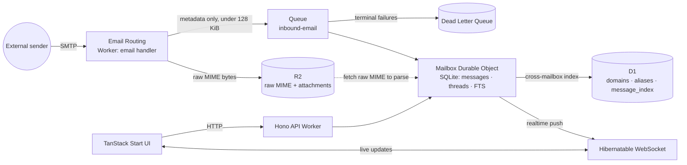

# Reccado Architecture

## Status

- Status: accepted architecture for initial build; implementation not started.
- Date: 2026-06-30.
- Source of truth: `internal planning notes (not in repo)`.
- Scope: architecture/ADR context only. This file is not a task list.

## Project Goal

Build a self-hosted, Cloudflare-maximalist inbox for Santi's app domains.

Tier A is a useful mailbox product without AI: receive, read, search, label, and send mail
across multiple domains.

Tier B adds Agents, MCP, and RAG on top for demos, reliability-audit material, and
agent-in-production learning. Tier B must not redefine Tier A's data model.

## Non-Goals

- Do not build a general ESP, campaign tool, or Gmail replacement.
- Do not make the AI agent an autonomous sender.
- Do not use D1 as the authoritative mailbox database.
- Do not put Workflows in the normal inbound hot path.
- Do not choose Astro or Next.js for the app shell.
- Do not copy or redistribute mailflare code.
- Do not let this side project displace the current agent-reliability sales work.

## System Context and Constraints

The system receives email for Cloudflare-managed domains and exposes a web inbox, realtime
updates, mailbox search, outbound sending, and optional MCP/agent tools.

Cloudflare primitives in the base architecture:

- Workers for HTTP, API, Email Routing handlers, queue consumers, and framework runtime.
- Durable Objects with SQLite for per-mailbox state, local scheduling, and realtime.
- R2 for raw MIME, attachments, and export artifacts.
- Queues plus DLQ for production inbound ingest.
- D1 for cross-mailbox and control-plane indexes.
- Email Routing for inbound mail.
- Email Service / `send_email` binding for outbound mail.
- Cloudflare Access for private UI auth.
- Hibernatable WebSockets for cheap realtime connections.
- Workflows for long, recoverable sagas once those sagas exist.
- Tier B: Agents SDK, `McpAgent`, OAuth Provider, Workers AI, Vectorize, and AI Gateway.

Key constraints:

- Queue payloads must be metadata only. Raw MIME can be too large for Queue messages.
- Raw MIME and attachments belong in R2, not Durable Object SQLite.
- One mailbox maps to one Durable Object, giving private storage and compute locality.
- Durable Object Alarms are good for light mailbox-local work, but they are not a full Queue.
- D1 is rebuildable/control-plane state, not the trunk.
- Realtime should terminate at mailbox Durable Objects through hibernatable WebSockets.
- Workflows should be lazy: use them for imports, exports, reindexing, backups, and approval
  waits, not for normal receive-and-index ingest.

## Legal Boundary

The legal and technical base is Cloudflare `agentic-inbox`, which is Apache 2.0.

`mailflare` is source-available with a restrictive license. It can inform architecture
patterns only: Email Routing to Queue, queue-based parsing/retries, D1 control-plane indexes,
provisioning flows, and Workflow-shaped long jobs.

Do not copy mailflare source code, schema, text, or file structure. Reimplement any adopted
pattern from first principles.

## Final Architectural Verdict

- Durable Object plus SQLite per mailbox is the source of truth.
- R2 stores raw MIME, attachments, imports, exports, and other large blobs.
- Queue plus DLQ is recommended for production ingest.
- Durable Object plus Alarms is acceptable only as a v0 ultraminimal alternative.
- D1 is a cross-mailbox/control-plane index, not mailbox storage.
- Hibernatable WebSockets provide realtime inbox updates.
- Workflows stay lazy until a real long saga exists.
- Agents, MCP, and RAG are Tier B and sit above the mailbox core.

The mailbox Durable Object is the only component allowed to decide canonical mailbox state.
Other components may request changes, cache summaries, or orchestrate work.

## Component Responsibilities and Data Ownership

| Component | Responsibility | Owns |
| --- | --- | --- |
| TanStack Start UI | Inbox, compose, settings, admin screens | Client state only |
| API Worker / Hono | Auth checks, API shape, DO routing | No durable mailbox data |
| Email handler | Validate inbound, write MIME to R2, enqueue metadata | No parsed mail state |
| Queue | Retryable ingest transport and DLQ | In-flight events only |
| Mailbox Durable Object | Mailbox behavior, ingest, rules, outbox, realtime | Canonical mailbox state |
| DO SQLite | Messages, threads, labels, read state, drafts, FTS, idempotency | Per-mailbox tables |
| R2 | Raw MIME, attachments, imports, exports | Blob content |
| D1 | Domains, aliases, mailbox registry, global summaries | Rebuildable indexes |
| Workflows | Durable orchestration for long jobs | Saga progress only |
| Access/OAuth | Identity and authorization envelope | Auth context |
| Agents/MCP/RAG | Drafting, search tools, semantic layer | Tier B derived state |

## Inbound Email Flow

1. Cloudflare Email Routing receives mail for a configured domain.
2. The Email Routing Worker validates recipient domain, alias, and mailbox routing.
3. The handler computes stable metadata: mailbox ID, R2 key, message ID, hash, sender,
   recipients, and timestamp.
4. The handler writes the raw MIME body to R2.
5. The handler enqueues a small metadata event to Queue.
6. The Queue consumer routes the event to the target mailbox Durable Object.
7. The Durable Object checks idempotency before processing.
8. The Durable Object reads MIME from R2 and parses headers, body, references, and attachments.
9. The Durable Object writes normalized rows, FTS data, labels, threads, and attachment
   references to SQLite.
10. The Durable Object updates D1 with thin cross-mailbox summaries if needed.
11. The Durable Object emits realtime updates to connected clients.
12. Failures retry through Queue; terminal failures land in DLQ for inspection and replay.

For a personal v0, steps 5 through 7 can be replaced by a DO-local `pending_jobs` table plus
an Alarm loop. That keeps infrastructure smaller but moves retry, backoff, poison-message,
and DLQ behavior into application code.

## Outbound Email Flow

1. A user or authorized MCP/agent action creates a draft.
2. The mailbox Durable Object stores the draft and approval state.
3. Agent-created drafts require explicit human approval before sending.
4. On approval, the Durable Object records an outbox attempt with an idempotency key.
5. Simple sends call the `send_email` binding under DO/API control.
6. Long sends with waits, retries, or policy checks use a Workflow and write results back to
   the Durable Object.
7. Sent content and attachments are stored or referenced in R2.
8. The Durable Object updates sent state, D1 summaries, and realtime clients.

Outbound mail must be auditable: who approved, what was sent, when it was sent, and what the
provider returned.

## Authentication and Security Model

- Cloudflare Access is sufficient for a private single-user or trusted-user UI.
- API routes map authenticated identities to allowed mailboxes and domains.
- Clients never choose Durable Object names directly without server-side authorization.
- Cross-mailbox D1 queries are filtered by caller permissions.
- R2 objects are private; downloads go through authorized Workers or signed access.
- Queue payloads contain metadata only, reducing sensitive content exposure in retry systems.
- Public or OSS multi-user MCP should use OAuth 2.1 style scopes per tool.
- MCP scopes should separate read, search, draft, label, and send.
- The agent may draft and summarize, but it may not send without human confirmation.
- Prompt-injection defenses wrap every email-to-agent path.
- Cloudflare API tokens for domain provisioning are narrow and environment-scoped.
- Secrets live in Cloudflare bindings or deployment secrets, not source files.
- Audit logs cover identity, mailbox mutations, outbound approvals, MCP calls, and agent drafts.

## Why Not D1 as Trunk

D1 centralizes data that should be isolated per mailbox.

The mailbox domain is object-shaped: messages, rules, threads, read state, drafts, outbox,
idempotency records, local jobs, and realtime subscribers all belong together.

Durable Objects provide compute locality, private SQLite storage, Alarms, and WebSockets in
one place. D1 does not own local compute, scheduling, or realtime sessions.

D1 remains valuable as a rebuildable cross-mailbox/control-plane index.

## Why Not Astro or Next

Next.js is rejected because OpenNext adds weight and complexity for a Workers-native app that
must export Durable Objects, Queues, Email handlers, and Cron.

Astro is strong for content sites and is now Cloudflare-adjacent, but this product is a
stateful realtime dashboard with compose flows and heavy app state. Astro's content-first and
islands model is not the primary shape.

The Cloudflare/Astro relationship does not outweigh that model mismatch.

## Why TanStack Start

TanStack Start fits an interactive React app while targeting Cloudflare Workers.

It gives the project:

- React compatibility with the agentic-inbox base.
- A full-stack app model without adopting Next/OpenNext.
- A Workers deployment path.
- Room for a custom entrypoint exporting DOs, Queues, Email handlers, and Cron.
- A natural fit with TanStack Router/Query patterns for dashboard state.

Risk: TanStack Start maturity. Pin versions, spike WebSocket routing early, and make framework
upgrades deliberate.

## Operational Notes

- Use Queue plus DLQ for production ingest from day one.
- Keep Queue messages small and metadata-only.
- Configure Queue retries, batch size, concurrency, and DLQ alerting explicitly.
- Make ingest idempotent across Email Routing retries, Queue retries, and DLQ replay.
- Keep MIME parsing out of the Email Routing handler.
- Treat D1 global indexes as eventually consistent and repairable.
- Use R2 lifecycle policies once retention rules exist.
- Use Cron for global maintenance such as backup scans or index repair.
- Use DO Alarms for light mailbox-local jobs: digest, retention, wakeups, or v0 local queues.
- Add structured logs around inbound receipt, R2 writes, Queue enqueue, DO ingest, and send.
- Test hibernatable WebSockets early; framework routing can interfere with upgrades.
- Keep Workflows out until there is a real saga.
- Route Tier B model calls through AI Gateway for observability, caching, and rate limits.

## Risks

- TanStack Start may change before 1.0.
- WebSocket upgrades through the app framework may be fragile; direct DO routing mitigates it.
- A high-volume mailbox can become a Durable Object hot spot.
- D1 index drift can confuse global search unless repair jobs exist.
- MIME parsing edge cases can consume CPU and should be measured.
- Outbound sending to arbitrary recipients may require Workers Paid and must respect limits.
- DO+Alarms as a Queue replacement can grow into custom infrastructure.
- Legal hygiene matters: mailflare is pattern-only.
- Agentic features require strict send approval, tool scopes, and prompt-injection boundaries.

## Official Sources

- agentic-inbox base: https://github.com/cloudflare/agentic-inbox
- Durable Objects SQLite storage: https://developers.cloudflare.com/durable-objects/api/sqlite-storage-api/
- Durable Objects WebSockets and hibernation: https://developers.cloudflare.com/durable-objects/best-practices/websockets/
- Durable Objects limits: https://developers.cloudflare.com/durable-objects/platform/limits/
- Email Service limits: https://developers.cloudflare.com/email-service/platform/limits/
- Email Service pricing: https://developers.cloudflare.com/email-service/platform/pricing/
- Queues batching, retries, and DLQ: https://developers.cloudflare.com/queues/configuration/batching-retries/
- Workflows: https://developers.cloudflare.com/workflows/
- Agents: https://developers.cloudflare.com/agents/
- TanStack Start on Cloudflare Workers: https://developers.cloudflare.com/workers/framework-guides/web-apps/tanstack-start/
- Cloudflare acquisition of Astro: https://www.cloudflare.com/press/press-releases/2026/cloudflare-acquires-astro-to-accelerate-the-future-of-high-performance-web-development/

